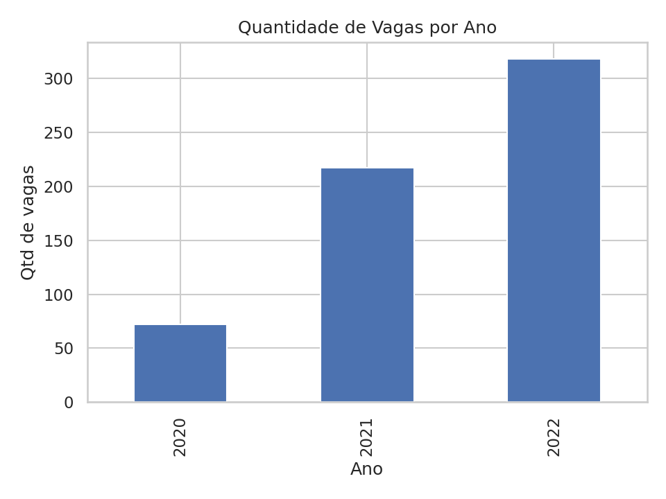
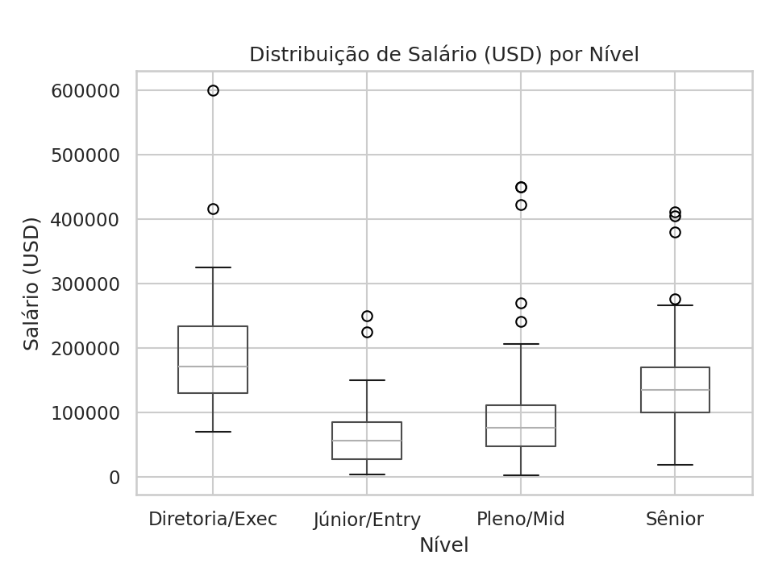
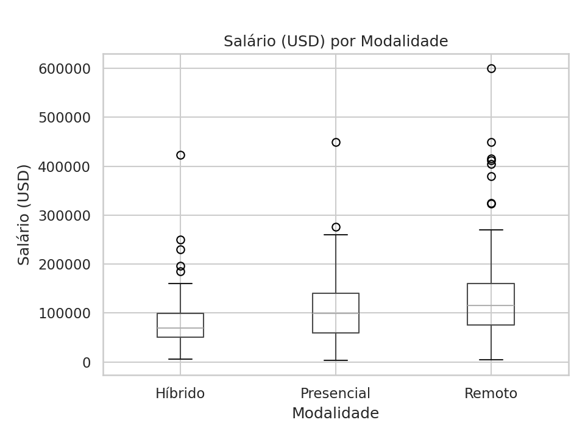
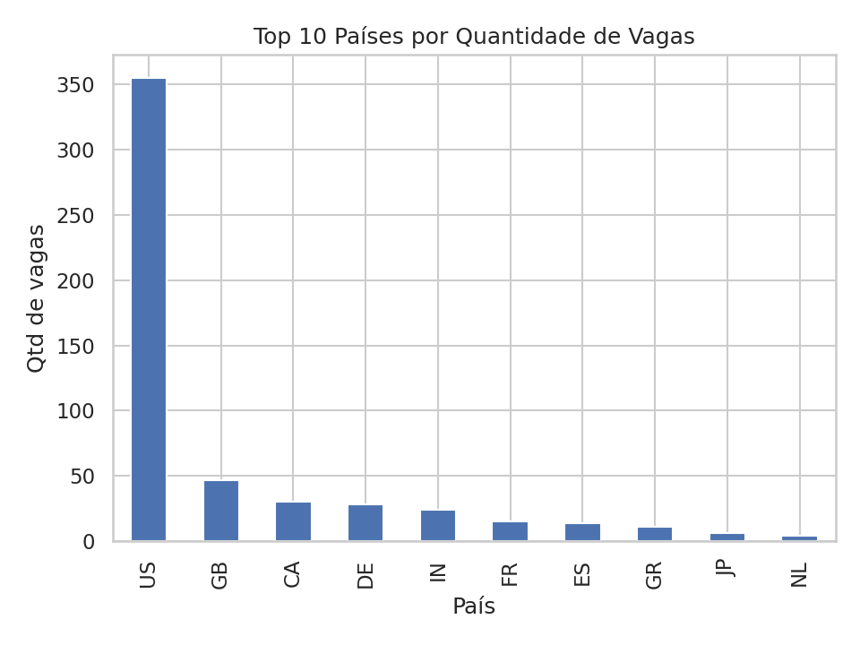

# Tendências de Empregos em Dados (2021–2024) 💼📊

**Pergunta central:** O que o mercado *realmente* está pedindo para quem quer trabalhar com dados?

## 🎯 Objetivo
Entender evolução de vagas, salários por nível, impacto do trabalho remoto e diferenças entre países usando um dataset público de empregos em dados.

## 🧩 Dados
- Fonte: [Data Science Job Salaries — Kaggle](https://www.kaggle.com/datasets/ruchi798/data-science-job-salaries)
- Período: **[coloque aqui: ex. 2020–2024]**
- Linhas: **[coloque aqui: ex. 6075]**

## ⚙️ Ferramentas
Python (Pandas, Matplotlib, Seaborn) • Google Colab • GitHub

## 📊 O que foi feito
1. Leitura e limpeza do CSV (tipos, nulos, padronização).
2. Exploração orientada por perguntas:
   - O mercado está crescendo ao longo dos anos?
   - Salário por nível (Júnior/Pleno/Sênior) — qual o gap?
   - Remoto × Híbrido × Presencial — quem paga mais?
   - Países: onde há mais vagas vs. maiores salários?
3. Visualizações salvas em `/outputs`.

## 📈 Destaques (resumo)
- Vagas: **[ex.: +125% de 2021 a 2024]**
- Salário médio global: **[ex.: US$ 92.000]**
- Gap de experiência: **[ex.: Sênior ~3× Júnior]**
- Remoto: **[ex.: ~15% acima do presencial/híbrido]**
- Países: **[ex.: EUA/DE/UK top salários; BR/IN alto volume]**

## 🖼️ Visualizações

## 📂 Estrutura
